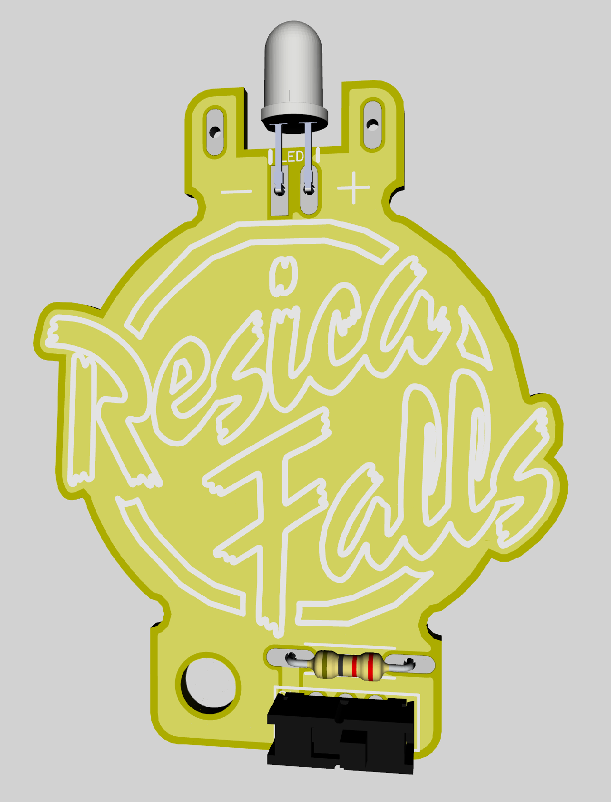

# 🧰 Electronics-Merit-Badge-Kit

Introductory soldering kit used to teach the Electronics Merit Badge at Resica Falls Scout Reservation.

---

---

## 📁 Directory Structure
This repository is organized using the following directory structure:

### 📐 `Schematic/`
- DipTrace project file and associated PDF export of the kit’s circuit design.  
- Although relevant schematic components are included in the `.sch` / `.pcb` DipTrace project files, separate DipTrace Component & Pattern Editor library files (`.eli` / `.lib`) are also provided.

### 🖼️ `PCB/`
- DipTrace project file and associated PDF export of the kit’s printed circuit board (PCB) layout.  

### 🧱 `3D Models/`
- 3D models of individual components and the overall assembly.  
- Original component model files have been modified to better illustrate kit assembly details.  Changes may include colorization of model faces and modification of component lead geometry.

### 🏭 `Production/`
- Gerber / ODB++ files required for PCB fabrication.  
- Bill of Materials (BOM) exports for component sourcing.

### 🛠️ `Assembly/`
- Step-by-step instructions for kit assembly.  
- Intended to be used as a starting point for Merit Badge instruction.  
- **📷 Photos:** See `Assembly/Photos/` for images of the assembled kit and build steps.

### 📜 `2019 Revision/`
- This directory contains a DipTrace project file reconstructed from Gerber files originally retained by the PCB vendor.  (The original 2019 design files were lost.)
- Resica Falls logo artwork is carried through into the current revision released in this repository.

## 🛡️ Licensing & Legal

### 🔓 Open Source Hardware

This project is licensed under the [CERN Open Hardware License Version 2 – Strongly Reciprocal (CERN-OHL-S v2)](https://ohwr.org/cern_ohl_s_v2.txt) and complies with the [Open Source Hardware Definition](https://www.oshwa.org/definition/).

All hardware design files, source code, and documentation are made available to encourage learning, reuse, and improvement.

### 📜 License Terms

This project is released under the **CERN-OHL-S v2 license**.  
You may redistribute and modify this documentation and make products using it under the terms of the license.

🔗 Full license text: [https://ohwr.org/cern_ohl_s_v2.txt](https://ohwr.org/cern_ohl_s_v2.txt)

Include a license notice in each design source file and schematic per the official guidance.

### ⚠️ Disclaimer

This hardware and its documentation are provided **"as is"** without any express or implied warranties, including (but not limited to) warranties of merchantability, fitness for a particular purpose, or non-infringement.

In no event shall the authors, contributors, or copyright holders be liable for:

- procurement of substitute goods or services  
- loss of use, data, or profits  
- business interruption  
- or any other direct, indirect, incidental, special, or consequential damages.

This kit is intended for **educational and instructional use only**.  
Users assembling, modifying, or using this kit do so **at their own risk**.  
Always follow proper safety procedures when working with electricity, soldering tools, or electronic components.

## 📅 Changelog

### `1.0.0` - 08Jun2025 - Zach Cross
- Initial Design Release

